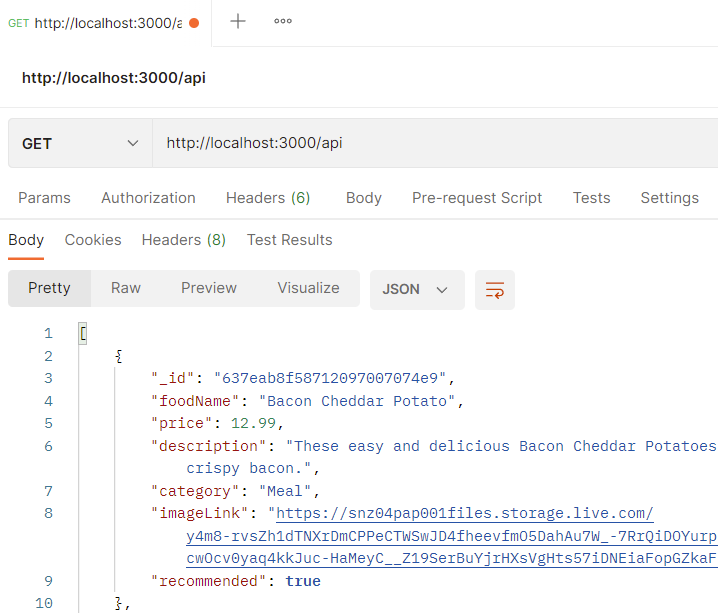
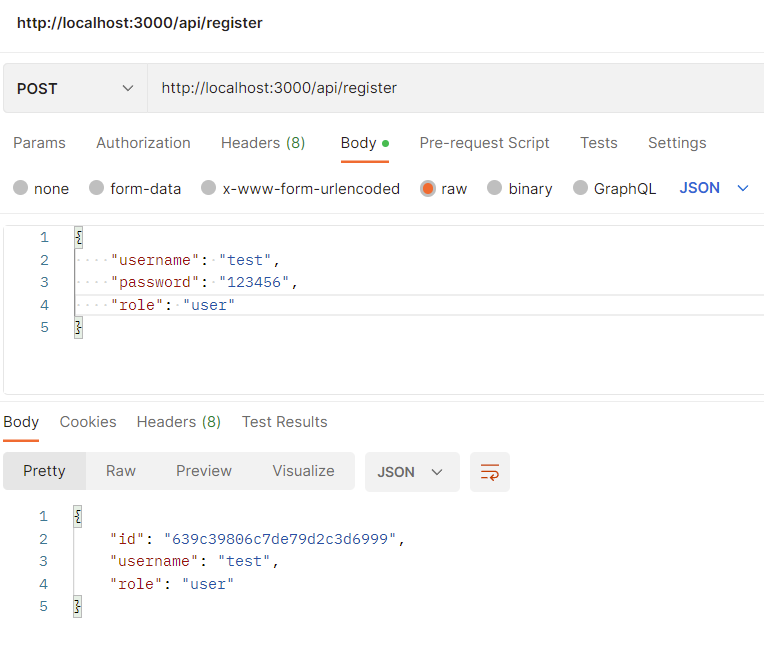
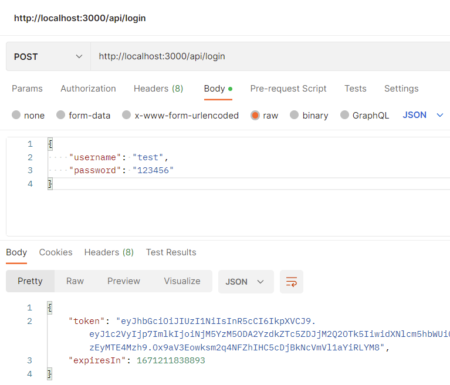
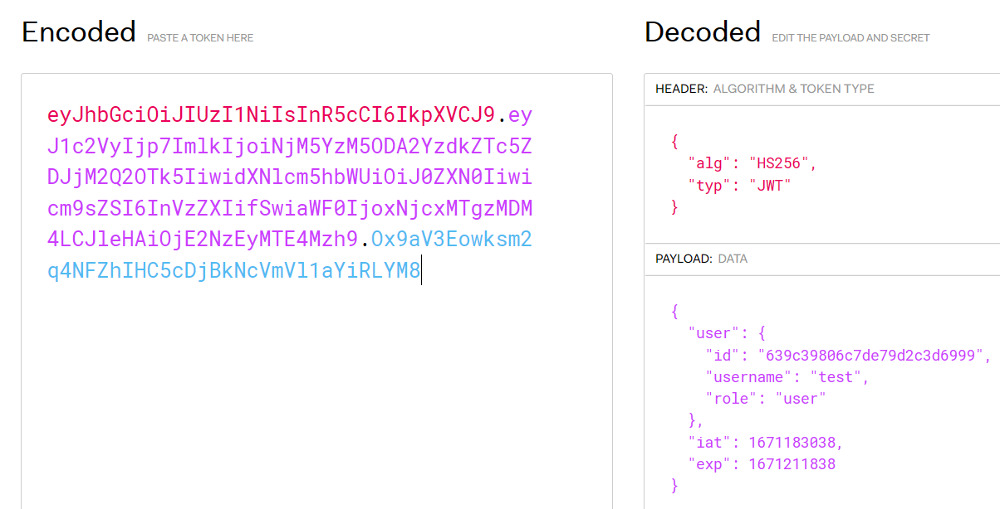
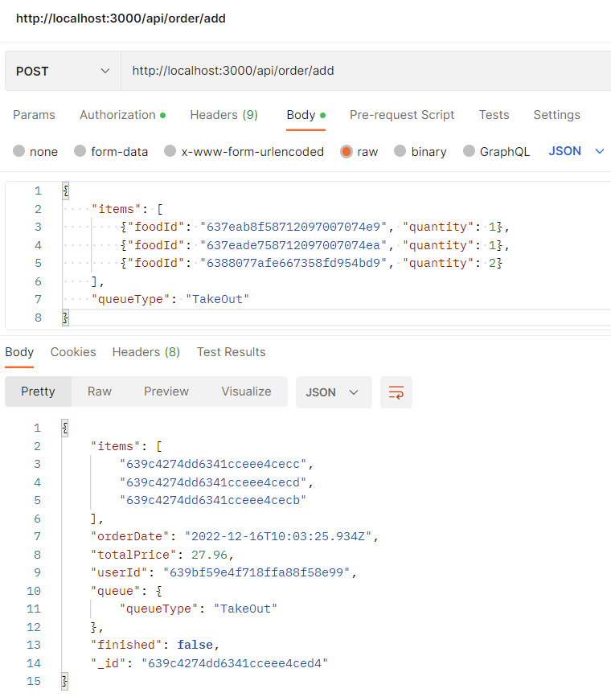
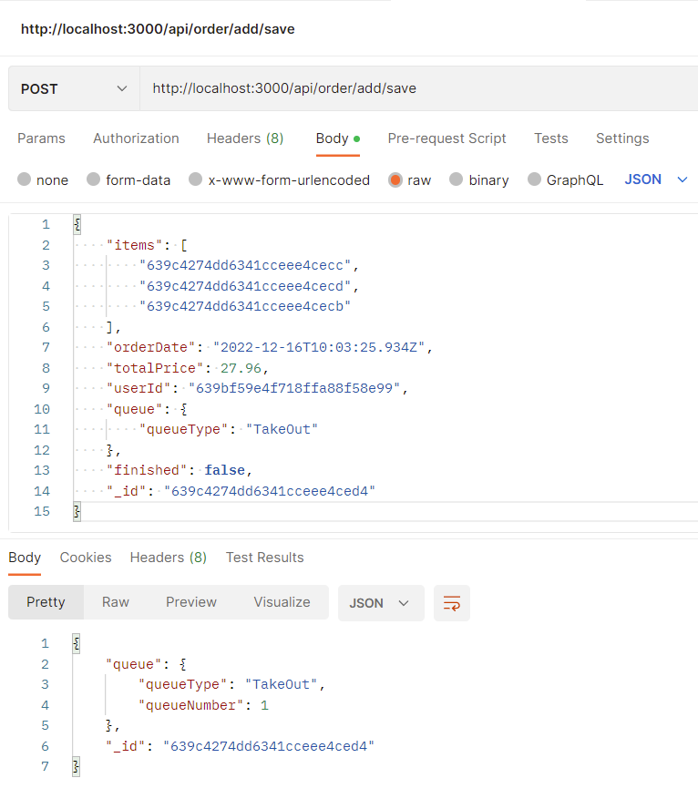
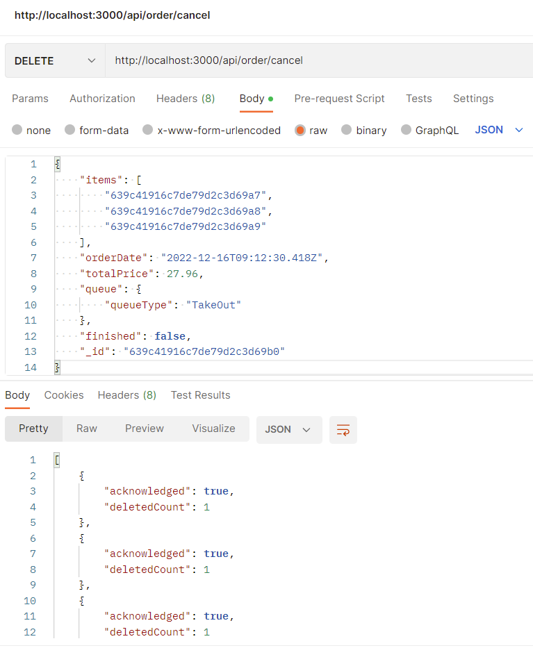
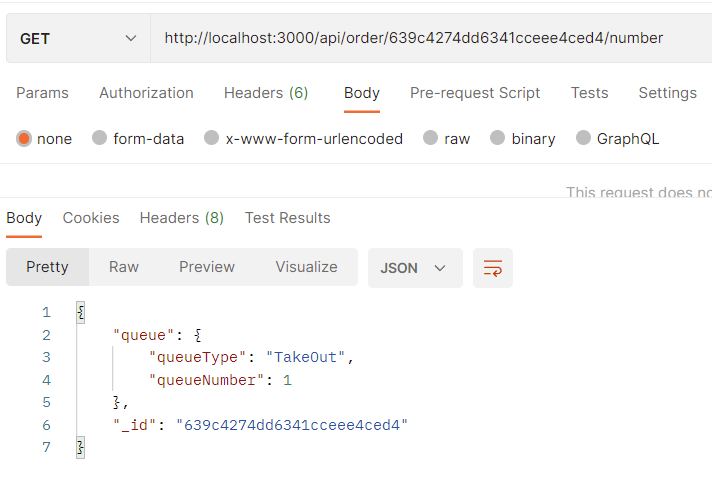
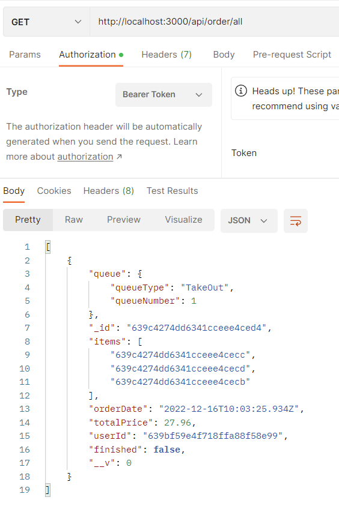
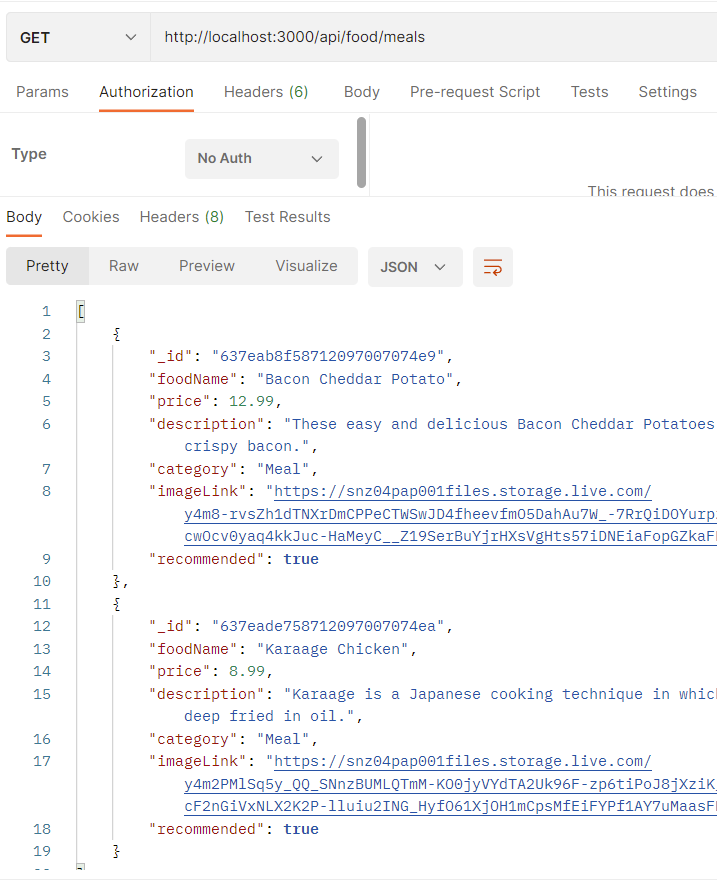

# Introduction

Back-End API based on NestJS. Global prefix: `/api`

Consists of 3 Types of API: 

- Auth

- Food

- Order

The following content will based on the structure of these types. 

# Root Endpoint

## /api (GET)

This end point returns all the foods object, with `recommended` field set to `true` , from the database. 

### Example

# Auth Endpoints

All the API endpoints related to Authentication feature. 

Using `JsonWebToken` strategy. `bcryptjs` as hashing library. 

## /api/register (POST)

- **Description**
  
  Register a user, hash the password, and save the user information in the database. 

- 

| Field    | Type              |
| -------- | ----------------- |
| username | String            |
| password | String            |
| role     | "admin" \| "user" |

- **Response Body**

| Field    | Type              |
| -------- | ----------------- |
| id       | String            |
| username | String            |
| role     | "admin" \| "user" |

> "admin" role has full privilegdes to access any endpoints, 
> 
> "user" role can have access the order list with its `Id` attached,
> 
> and can create order document with its `id` attached

### Example

## /api/login (POST)

- **Description**
  
  Signs a user in, and returns
  
  - **jsonWebToken**
  
  - **expireTime** for the token.

- **Request Body Format (JSON)**

| Field    | Type   |
| -------- | ------ |
| username | String |
| password | String |

- **Response Body (JSON)**

| Field     | Type               |
| --------- | ------------------ |
| token     | String             |
| expiresIn | String (TimeStamp) |

### Example

## JWT explaination

A token that

- verifies whether the user has logged in

- access some **authorization-required** API endpoints

- should be included in the **request headers**

- contains an expire time (8 hours for this App)

- should log user out when expires

> For front-end, you can stores token and expire time in `cookie` or `localStorage`. Once the token expires, remove them from that storage, and redirect user to login page.

- the payload contains `id`, `username`, and `role` information of the user

- can decode token with `verify` and `decode` method in `jwt` library

- can also decode in [JSON Web Tokens - jwt.io](https://jwt.io/)

### Example

# Order Endpoints

## /api/order/add (POST)

- **Description**

Temporarily generates an order document, and return it.

Write the orderItem documents in the order to the database'

> The order document will not be written to database at this point

- **Request Body Format (JSON)**

| Field      | Type                                   | Description                             |
| ---------- | -------------------------------------- | --------------------------------------- |
| items      | { foodId: String, quantity: Number }[] | array of order items                    |
| items.item | { foodId: String, quantity: Number }   | items in the array                      |
| queueType  | "TakeOut" \| "DineIn"                  | type of order:   Take Out or Dine In |

- **Response Body Format (JSON)**

An order document, only without `queueNumber` field for the `queue` object.

| Field           | Type                  | Description                                                                                |
| --------------- | --------------------- | ------------------------------------------------------------------------------------------ |
| items           | String[]              | array of order item's id                                                                   |
| orderDate       | Date                  | MongoDB will always store date in UTC time                                                 |
| userId          | String                | **optional**. If headers contain jwt, then order will attach user id in the order document |
| totalPrice      | Number                | Total price of all the order item with price times quantity                                |
| queue           | object                | object describing the order in queue                                                       |
| queue.queueType | "TakeOut" \| "DineIn" | Type of Order in queue                                                                     |
| finished        | boolean               | indicate the order has been completed                                                      |
| _id             | String                | id in the database                                                                         |

### Example

## /api/order/add/save (POST)

- **Description**

Save the order document in the database. Usually after the order is confirmed.

- **Request Body Format (JSON)**

An order document, only without `queueNumber` field for the `queue` object.

> Can just use the document returned by `api/order/add`

| Field           | Type                  | Description                                                                                |
| --------------- | --------------------- | ------------------------------------------------------------------------------------------ |
| items           | String[]              | array of order item's id                                                                   |
| orderDate       | Date                  | MongoDB will always store date in UTC time                                                 |
| userId          | String                | **optional**. If headers contain jwt, then order will attach user id in the order document |
| totalPrice      | Number                | Total price of all the order item with price times quantity                                |
| queue           | object                | object describing the order in queue                                                       |
| queue.queueType | "TakeOut" \| "DineIn" | Type of Order in queue                                                                     |
| finished        | boolean               | indicate the order has been completed                                                      |
| _id             | String                | id in the database                                                                         |

- **Response Body Format (JSON)**

| Field             | Type                  | Description                          |
| ----------------- | --------------------- | ------------------------------------ |
| queue             | Object                | object describing the order in queue |
| queue.queueType   | "TakeOut" \| "DineIn" | Type of Order in queue               |
| queue.queueNumber | Number                | The number of Order in queue         |
| id                | String                | order id in database                 |

### Example

## /api/order/cancel (DELETE)

- **Description**

Delete the order items written to the database when access to `api/order/add`. 

Usually send the request after user cancel the order in confirmation page. 

- **Request Body Format (JSON)**

An order document, only without `queueNumber` field for the `queue` object.

> Can just use the document returned by `api/order/add`

| Field           | Type                  | Description                                                                                |
| --------------- | --------------------- | ------------------------------------------------------------------------------------------ |
| items           | String[]              | array of order item's id                                                                   |
| orderDate       | Date                  | MongoDB will always store date in UTC time                                                 |
| userId          | String                | **optional**. If headers contain jwt, then order will attach user id in the order document |
| totalPrice      | Number                | Total price of all the order item with price times quantity                                |
| queue           | object                | object describing the order in queue                                                       |
| queue.queueType | "TakeOut" \| "DineIn" | Type of Order in queue                                                                     |
| finished        | boolean               | indicate the order has been completed                                                      |
| _id             | String                | id in the database                                                                         |

- **Response Body Format (JSON)**

The MongoDB information indicates the data in the database in successfully deleted

### Example

## /api/order/{orderId}/number (GET)

- **Description**

{orderId} is a parameter, replace it with actual ID of an order. 

returns the queue object along with the order id it ask with.

Performs as same as `/api/order/add/save`

- **Request Body Format (Not Body)**

- **Response Body Format (JSON)**

| Field             | Type                  | Description                          |
| ----------------- | --------------------- | ------------------------------------ |
| queue             | Object                | object describing the order in queue |
| queue.queueType   | "TakeOut" \| "DineIn" | Type of Order in queue               |
| queue.queueNumber | Number                | The number of Order in queue         |
| id                | String                | order id in database                 |

### Example

## /api/order/all (GET) (Guarded)

- **Description**

return a list of all order, if the user role is "admin",

return a list of all orde that has the id of that user, if the user role is "user",

`401 Unauthorized` if jwt has not given in the request headers. 

- **Request Body Format (No Body)**

- **Response Body Format (JSON)**

A list of order documents. 

### Example

# Food Endpoints

## /api/food/meals|desserts|drinks|snacks (GET)

- **Description**

return a list of food in one of the categories (meals, desserts, drinks, snacks)

- **Request Body Format (No Body)**

- **Response Body Format (JSON)**

A list of food documents.

### Example

